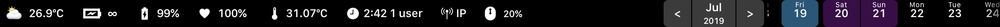

# BetterTouchBar
Use BetterTouchTool to make TouchBar better.


- Button 1
```
Tap: ESC
Long Press: Toggle BetterTouchBar
```

- Button 2
```
Tap: Dock (Press the back button on the left to back; long press to toggle BTT)
```

```
Long Press: Open your work folder
```

- Button 3
```
Tap: Move window to left side of screen
Long Press: Move window to left slide of screen
```

- Button 4
```
Tap: Move window to right side of screen
Long Press: Move window to right slide of screen
```

- Button 5
```
Tap: Maxmize window
Long Press: Fullscreen
```

- Button 6
```
Tap: Revert window to original size 
Long Press: Move window to center of screen
```

- Button 7
```
Tap: Resize window to 960*600
Long Press: Resize window to 1280*800
```

- Button 8
```
Tap: Save
Long Press: Save as...
```

- Button 9
```
Tap: New window
Long Press: New tab
```

- Button 10
```
Tap: Close window/tab
Long Press: Quit App
```

- Button 11
```
Tap: Hide window
Long Press: Minimize window
```

- Button 12
```
Tap: Delete selected file
Long Press: Empty trash
```

- Button 13
```
Tap: Eject selected disk
Long Press: Eject all disks
```

- Button 14
```
Tap: Add files to Yoink
Long Press: ScreenSaver
```

- Button 15
```
Tap: Toggle dark mode
Long Press: Toggle Night Shift
```

- Button 16
```
Tap: Hide menu items on the left of bettertouchtool icon
Long Press: Toggle Do Not Disturb
```

- Button 17
```
Tap: Mute/Unmute
Long Press: Show Brightness and Volume slide bars (Press the back button on the left to back; long press to toggle BTT)
```


- Button 18
```
Tap: Connect/Disconnect your Airpods 
```
(Need to install [BluetoothConnector](https://github.com/lapfelix/BluetoothConnector))


- Button 19
```
Tap: Pause/Play music
Long Press: Next track
```

- Button 20
```
Tap: Toggle input method between 简体中文 & ひらがな
```
(Need to install [im-select](https://github.com/daipeihust/im-select))
```
Long Press: Show Emoji Bar (Press the back button on the left to back; long press to toggle BTT)
```


- Button 21
```
Show Current Date and Time
Tap: Show Widget (Tap any item to back; long press to toggle BTT)
```

```
Weather / Battery Status / Battery Percentage / Battery Health / Battery Temperature / System Uptime / External IP / Calendar / Magic Mouse Battery
```
